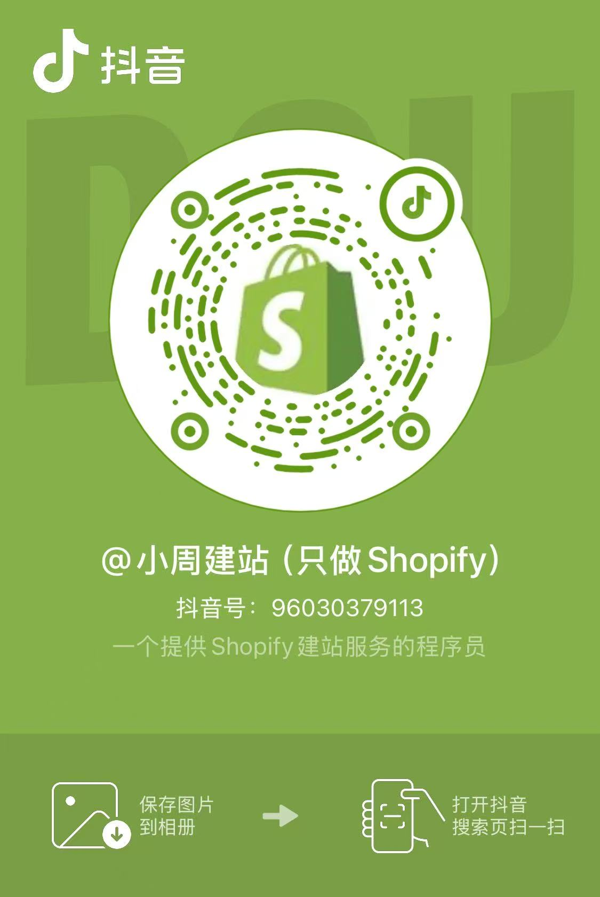

# 小周建站

你好，我是小周，程序员出身，专注 Shopify 建站。

我不做模板拼装。不转包项目。不夸张承诺。

我只做一件事：

> 把你的想法，真正落地成一个可维护、可扩展、可成交的 Shopify 独立站。

微信：fluidcat

## 如果你遇到过这些问题

### **开发过程混乱**

1. 项目被转包，需求传来传去最后变味
2. 开发周期被拖延，上线一拖再拖
3. 报价说不清，后续反复追加修改费用

### **页面效果不稳定**

1. 网站卡顿，打开速度慢
2. 手机端看着还行，电脑端布局就错位
3. 做出来的效果和预期不一致

### **后期维护困难**

1. 想自己改内容，发现根本不好改
2. 页面和模块没法继续扩展

## **服务内容**

### **Shopify 二次开发**

适合已经有网站，但结构、布局或交互需要重新整理和优化的项目，适合

1. 现有网站结构混乱
2. 页面布局不合理
3. 想加新页面、新模块
4. 想加动效或高级交互
5. 想重做部分页面但不想全部推翻

### **Shopify 独立站定制开发**

如果你已经有参考网站、设计稿，或者明确的竞品目标，我可以按结构和交互逻辑高还原落地。

1. 基于参考站或设计稿做页面开发
2. 兼顾前台效果和后台可维护性
3. 适配桌面、平板和手机端

## 案例展示

### Pagerie 仿站（开发中）

我正在做 1:1 视觉级复刻开发，目标不是只把页面“做出来”，而是保证网站后续还能维护和扩展。

原网站：[Pagerie](https://www.pagerie.com/) —— 一个高端宠物品牌网站

我的复刻版本：[Pagerie仿站](https://pagerie-copy.myshopify.com/) （**网站访问密码123，推荐用外网访问**）

## 为什么直接找我，而不是找建站公司？

### ✔ 沟通链路只有 1 层

你的项目不会被转包N次，我对你的网站负直接责任。

没有中间销售，没有项目经理转述，。你的需求不会被“翻译错”。

### ✔ **响应更及时**

我是全职建站，不是兼职建站，同一时间只做一个网站。

开发期间有新想法、新问题，可以直接沟通，不需要层层排队确认。

### ✔ 明确边界，不乱承诺

能做什么，不能做什么，能做到什么程度，我会说清楚。

哪些要收费，哪些不收费，有没有后续收费，我会说清楚。

我不会为了接单答应所有功能和需求。

我更在意长期合作，而不是一单成交。

## 我的服务

### 基础服务

1. 定制 Shopify 网站
2. 桌面端与移动端适配
3. 页面模块支持后续增减
4. 源代码交付
5. 协助接入 PayPal、Stripe、Shopify Payments 等收款方式（请提前准备好合规的收款账号）
6. 协助上传不超过 20 个产品及对应图片、文案素材（请提前准备好素材）

### 增值服务

以下内容不包含在建站服务里，需要单独评估和报价。对于刚入行的人或者新网站，不建议先做这部分

1. 多语言切换
2. 多币种切换
3. 复杂交互动效

## 现在是否适合找我？

如果你已经想清楚方向，可以直接开始聊需求。

- 已经决定使用 Shopify
- 需求方向明确
- 重视网站质量与长期维护
- 希望找长期合作的开发者
- 有一定预算

## 报价

建站 800 元起，二次开发 200 元起。

默认 50% 定金，50% 尾款在验收通过后支付。

如果中途新增页面、新模块或大改页面，会重新评估工时和报价。

拿[brevite.co](https://brevite.co/)（卖相机包和摄影配件）这个网站举例，按照1:1仿站开发：

1. [主页](https://brevite.co/) 600，外加一个很极简的产品页
2. [产品页](https://brevite.co/products/the-jumper-photo-2-0?variant=53003168186734) 900
3. [集合页](https://brevite.co/collections/school) 400
4. 页脚的次级页面 800（包含以下几个页面）
   1. [Contact Us](https://brevite.co/pages/contactus?hcUrl=%2Fen-US)
   2. [Return](https://brevite.co/pages/contactus?hcUrl=%2Fen-US%2Farticles%2Freturn-134740)
   3. [Warranty](https://brevite.co/pages/contactus?hcUrl=%2Fen-US%2Farticles%2Fwarranty-134741)
   4. [Wholesale](https://brevite.co/pages/carry-our-brand)
   5. [Corporate Sales](https://brevite.co/pages/b2b)

**以上参考价默认不包含**

1. 不包含多语言、多币种
2. 不包含交互动效
3. 不包含[搜索结果页](https://brevite.co/search?q=bag&options%5Bprefix%5D=last)
4. 不包含[登录页、个人中心面](https://brevite.co/account)
5. 不包含[故事页](https://brevite.co/pages/our-story)

**如果你想压缩预算**

1. 去掉产品页的评论区 —— 如果前期没有太多用户反馈的话
2. 去掉集合页 —— 如果前期产品不多的话，所有产品放在主页展示
3. 去掉页脚的次级页面 —— 精简内容，信息放在主页
4. 去掉邮箱订阅框 —— 如果前期不写内容发邮箱给消费者的话
5. 去掉PC端布局 —— 先上线手机端
6. 去掉付款 —— 如果你是做B端外贸展示站
7. 去掉任何对你当前阶段不必要的部分

## 联系方式

微信：fluidcat

抖音：小周建站（只接Shopify）

2- 长按复制此条消息，打开抖音搜索，查看TA的更多作品。 https://v.douyin.com/uJAG4ODU_uA/ 7@8.com :0pm

电子邮箱：xiaozhoujianzhan@outlook.com

## 闲言碎语

### 建站包含域名吗？

Shopify 会提供一个 `xxxx.myshopify.com` 格式的默认域名。正式上线还是建议单独购买自定义域名，我可以协助你完成绑定。

我个人通常在[namesilo](https://www.namesilo.com/)买域名，如果你想最省事，可用直接在Shopify买。

### 建站包含服务器吗？

Shopify 平台本身已经包含托管、CDN、SSL 等基础能力，不需要你另外单独买传统服务器。

### **为什么选 Shopify，而不是 WordPress？**

一句话：Shopify的订阅费对得起它提供的服务，真的很省心。

光是提供的服务器就已经物超所值了，如果重点是做电商，Shopify 的后台、支付、订单和运营链路更省事，后期维护成本也更低。

说三个细节：

1. Shopify有自己的电商平台Shop，后期多一个C端销售渠道
2. Shopify有自己的风控系统，会标识出高风险订单，减少商家资金损失
3. Shopify有自己的手机 App，供你实时查看订单、查看店铺数据、管理库存等等

### **Shopify 平台本身要花多少钱？**

请查看[Shopify 定价](https://www.shopify.com/zh/pricing)，这里有你想知道的一切

### WordPress 在 SEO上的表现比 Shopify 更好吗？

不一定。WordPress 在“可控性”、“自由度”上更高，但并不代表天然排名更好。

真正决定 SEO 的，是结构、内容、外链和执行能力，比如高质量内容、清晰类目结构、良好用户行为数据。

平台只是工具，执行才是关键。

### **建站服务包含 SEO 吗？**

Shopify 已经包含了技术方面的SEO，比如页面结构、加载体验、站点收录相关配置。

网站搭建完毕后，我会接入 Google Search Console，提交Sitemap，确保你的网站能被收录。

但是建站服务不包含运营方面的SEO，比如关键词研究、写内容、搭建外链和“把排名做上去”。

# 域名

## 域名提供商

价格按照.com域名计算

越冷门的域名后缀越便宜，，有些甚至几美刀一年

| 平台                     | 首年价格 | 续费价格 | 是否可迁移 | DNS速度    | 学习成本 | 是否支持支付宝 | 优点                           | 缺点                    |
| ------------------------ | -------- | -------- | ---------- | ---------- | -------- | -------------- | ------------------------------ | ----------------------- |
| **Cloudflare Registrar** | $10.46   | $10.46   | ✔          | ⭐⭐⭐⭐⭐ | 中       | ❌             | 成本价出售、DNS/CDN/WAF最强    | 必须使用 Cloudflare DNS |
| **Namecheap**            | $11.28   | $14.98   | ✔          | ⭐⭐⭐⭐   | 低       | ❌             | 界面简单、教程多、免费隐私保护 | 续费较贵                |
| **NameSilo**             | $17.29   | $17.29   | ✔          | ⭐⭐⭐     | 中       | ✔              | 支持支付宝、价格稳定           | 面板老                  |
| **GoDaddy**              | $0.01    | $22      | ✔          | ⭐⭐⭐     | 低       | ✔（部分地区）  | 品牌最大、客服多               | 续费非常贵              |
| **Shopify 域名**         | $16.00   | $16.00   | ⚠          | ⭐⭐⭐⭐   | 极低     | ❌             | 与 Shopify 自动绑定            | 管理能力弱              |

## 网站加速

统一用cloud flare加速，后面出视频讲怎么操作

## 连接域名到自己的网站

后面出视频讲，拿Shopify举例

## 域名后缀

### 域名后缀的含义

| 域名后缀    | 全称 / 含义             | 原始用途       | 常见使用者                   | SEO / 信任度 |
| ----------- | ----------------------- | -------------- | ---------------------------- | ------------ |
| **.com**    | Commercial              | 商业机构       | 企业、品牌、独立站           | ⭐⭐⭐⭐⭐   |
| **.net**    | Network                 | 网络服务商     | IT公司、互联网公司           | ⭐⭐⭐⭐     |
| **.org**    | Organization            | 非营利组织     | NGO、社区组织                | ⭐⭐⭐⭐     |
| **.edu**    | Education               | 教育机构       | 大学、学校                   | ⭐⭐⭐⭐⭐   |
| **.gov**    | Government              | 政府机构       | 政府部门                     | ⭐⭐⭐⭐⭐   |
| **.io**     | Indian Ocean            | 英属印度洋领地 | 科技公司、SaaS               | ⭐⭐⭐⭐     |
| **.co**     | Company                 | 公司           | 创业公司、品牌               | ⭐⭐⭐⭐     |
| **.app**    | Application             | 应用程序       | App、SaaS                    | ⭐⭐⭐⭐     |
| **.dev**    | Developer               | 开发者         | 技术网站                     | ⭐⭐⭐       |
| **.ai**     | Artificial Intelligence | 安圭拉国家域名 | AI公司                       | ⭐⭐⭐⭐     |
| **.shop**   | Shop                    | 商店           | 电商网站                     | ⭐⭐⭐       |
| **.store**  | Store                   | 商店           | 独立站                       | ⭐⭐⭐       |
| **.studio** | Studio                  | 工作室         | 摄影师、设计工作室、创意团队 | ⭐⭐⭐       |
| **.design** | Design                  | 设计           | 设计师、设计机构             | ⭐⭐⭐       |
| **.art**    | Art                     | 艺术           | 艺术家、艺术机构、画廊       | ⭐⭐⭐       |
| **.online** | Online                  | 在线业务       | 各类网站                     | ⭐⭐         |
| **.site**   | Site                    | 网站           | 各类项目站                   | ⭐⭐         |
| **.xyz**    | 无特定含义              | 通用域名       | 项目站、实验站               | ⭐⭐         |
| **.biz**    | Business                | 商业           | 小企业                       | ⭐⭐         |
| **.info**   | Information             | 信息网站       | 信息站、博客                 | ⭐⭐         |

### 域名后缀对SEO排名的影响

一句话：搜索引擎一视同仁，但用户更信任顶级域名

Google明确说明域名后缀不会直接影响排名**，**`.com`、`.net`、`.store` 在算法里基本同权

但是实际流量还是有差异。原因在用户层面，用户更信任`.com`域名，以及本国家的国家域名（`.us`、`.jp`、`.cn`等等）

**用户对网站的SEO产生的间接影响**

用户更信任.com域名 → 用户偏向点击.com域名的网页 → 网页点击率提升 → Google认为页面更好 → 网站权重提升

### 域名名字

推荐品牌名/产品 + 简单好记，这部分让AI推荐，主要关注两个点

1. 长度：越短越好，最好不超过10个字母
2. 是否好记：朗朗上口、发音简单、拼写简单

### 域名名字对SEO的影响

1. ~~搜索：用户搜索关键词 → 域名包含关键词 → 搜索结果排名提升~~（早就失效了，别把Google当傻子）
2. 内链：域名名字如果包含产品关键词，比如camera bag，再插入内链的时候搜索引擎能识别到
3. 用户点击率：用户更容易点击域名包含产品关键字的域名
